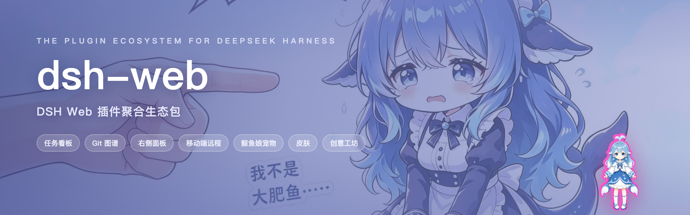
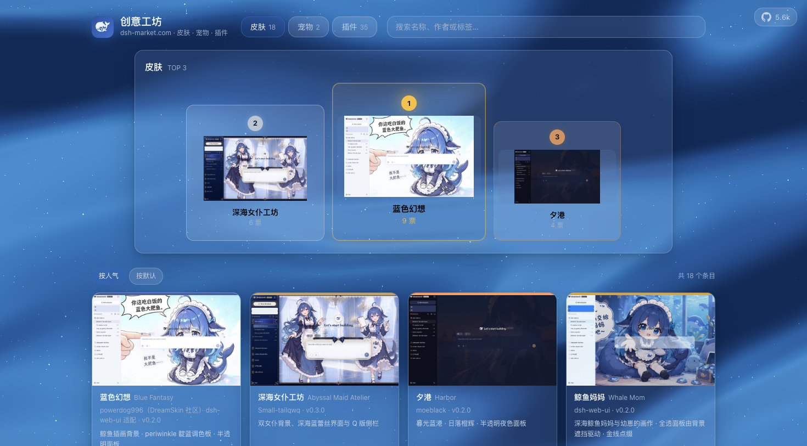
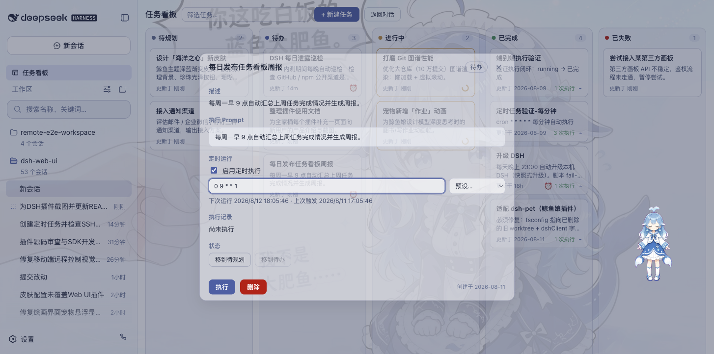
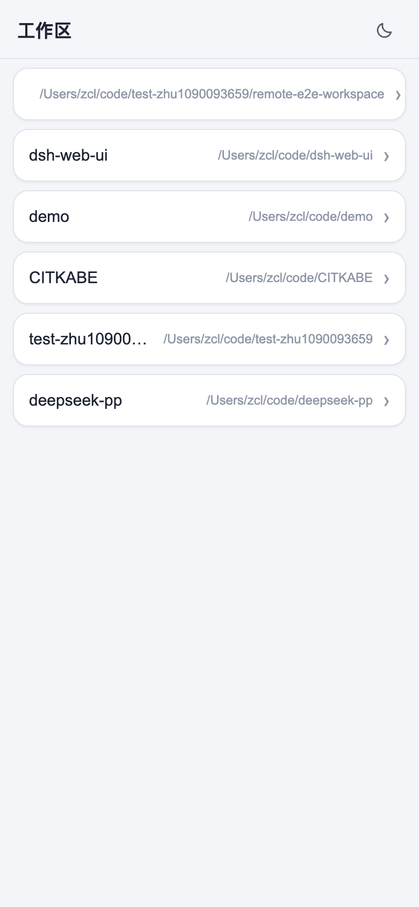
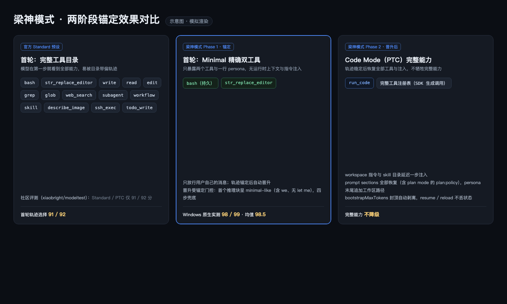
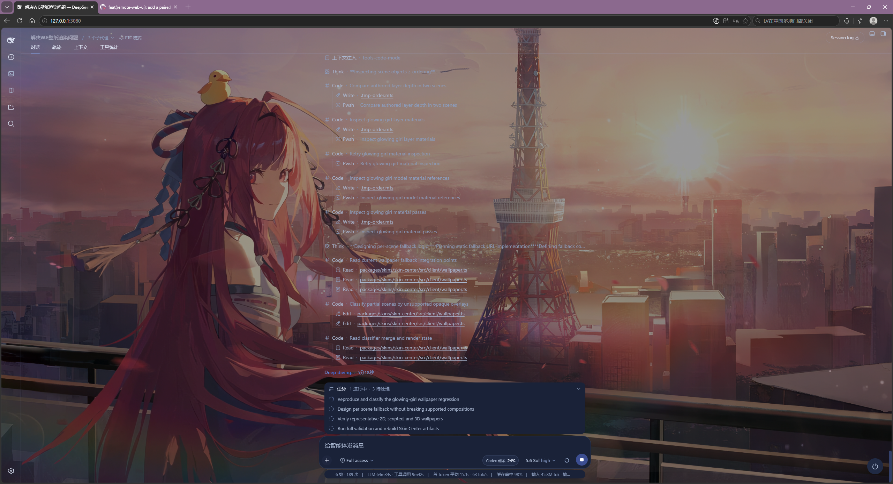
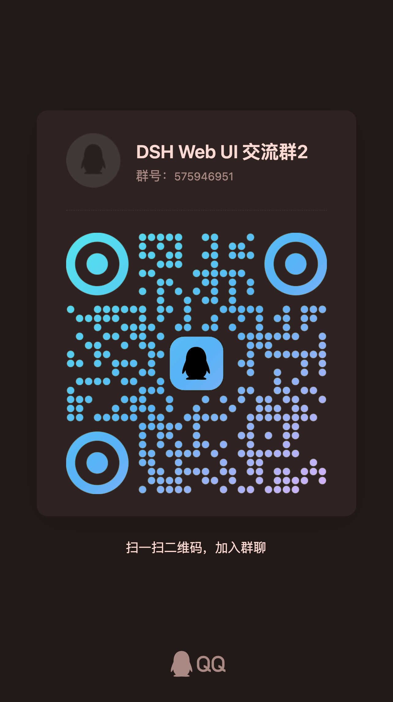

# dsh-web · Aggregate Plugin Ecosystem for DSH Web

[中文](README.md) | English

<p align="center">
  
</p>

<p align="center">
  
  &nbsp;
  
  &nbsp;
  
  &nbsp;
  <a href="https://www.npmjs.com/package/@linxin666/dsh-web-all"></a>
  &nbsp;
  <a href="https://www.npmjs.com/package/@linxin666/dsh-web-all"></a>
  &nbsp;
  
</p>

<p align="center">
  <strong>The aggregate plugin ecosystem for DeepSeek Harness (DSH) Web · Everything is a plugin</strong><br>
  <em>Liang Shen Mode · Task Board · Mobile Remote · SSH Ops · Image Understanding · Whale-Girl Pet · Skins · Workshop</em>
</p>

<div align="center">

[What It Is](#what-it-is) · [Workshop](#workshop-dsh-marketcom) · [Feature Plugins](#feature-plugins) · [Skins](#skins) · [Quick Start](#quick-start) · [FAQ](#faq) · [Known Limitations](#known-limitations) · [Community](#community)

</div>

## What It Is

dsh-web is the aggregate plugin ecosystem for DeepSeek Harness (DSH) Web — the most complete realization of "everything is development, everything is a plugin" on the web: Liang Shen Mode, the task board, mobile remote, SSH ops, image understanding, the right panel, the whale-girl pet and skins each ship as an independent, self-contained plugin — pluggable, swappable, re-developable. Install the whole family to assemble a complete dev workbench, or pick one or two and they melt quietly into the stock UI. Everything mounts into `dsh web` through the official profile mechanism, no DSH source changes; the aggregate can even bolt on external plugins like `dsh-better-sidebar` — see the [dsh-web-all README](packages/dsh-web-all/README.md).

Skins live inside the same plugin system: a v2 skin is a pure asset directory (a skin.json manifest plus styles, art and optional effect scripts), loaded by the skin-center plugin, the single loader — official upgrades no longer touch any skin, and adding one means dropping it into \`$DSH_HOME/skins/<id>/\`: no publish, no install. Whale Song is distributed as an independent skin repository ([dsh-skin-whale-song](https://github.com/znc15/dsh-skin-whale-song)). Plugins own the logic, skin assets own the look.


| Capability | Stock dsh web | dsh-web family |
| --- | --- | --- |
| Agent presets | Official presets (Standard / Minimal…) | Liang Shen Mode: two-phase anchoring tuned for V4 Pro |
| Task board | None | Multi-column board + cron-scheduled real runs |
| Mobile remote control | None | QR pairing with SSE real-time sync; the same link also pairs a PC browser |
| Remote server ops | None | SSH panel: terminal / transfer / tunnels / cluster |
| Image understanding | None | `describe_image` vision tool |
| File preview & changes | None | Right panel: explorer / editor / terminal / git / browser |
| Companion pet | None | Whale girl: reacts to agent state, feeding and bonding |
| Git visualization | None | Branch picker + commit history graph |
| Themes & skins | Default theme (none bundled; Whale Song from its own repo) | Skins plugin with no bundled skins (Whale Song installs from [dsh-skin-whale-song](https://github.com/znc15/dsh-skin-whale-song)) + a custom-theme editor, try-on before apply |

## Workshop (dsh-market.com)

The [Workshop](https://dsh-market.com) (dsh-market.com) is DSH's one-stop home for creations: skins, pets and plugins in one place, each category ranked by device-backed likes with the top three on the landing-page podium; skins preview in a live try-on, plugins expose one-copy install commands. The Workshop settings card inside the Web GUI browses the catalog directly — skins and pets install into the DSH home directories in one click, plugins go through the plugin manager, and everything shows up in the skins and pet panels afterwards.



The site itself is also built from this repository: a static build generated deterministically by `scripts/market-build` from the three sources of truth (`skin.json` / `pet.json` / `community.json`); dynamic features like likes run on a Cloudflare Workers edge API (D1 persistence, one vote per device) and deploy automatically on every push to `main`.

The Workshop takes its cue from the Steam Workshop: a place where community creations are discovered, tried on and installed in one click, and where authors' work gets seen and liked. Come build it with us.

## Feature Plugins

### Task Board

Open it from the sidebar. Tasks sit in five columns: Planned, To-do, In Progress, Done, Failed. Click "Run" on a card and the task goes to a real DSH agent session; the card status updates itself when it finishes. Want to see what happened? Jump back into the execution session for the full transcript.

Tasks can also run on schedule: set a cron expression in the detail view (auto-upgrade DSH at 23:00 every day, weekly report at 09:00 every Monday) and it starts on its own. No babysitting.

| Multi-column board | Scheduled execution |
| --- | --- |
|  |  |

### Mobile Remote Control

The phone icon at the bottom of the sidebar opens the pairing panel. Scan the QR code (or copy the link) and the phone lands on a standalone mobile surface for the current dsh web workspace: browse and create sessions, send and receive messages, switch models and reasoning effort, adjust the permission preset, all in sync with the desktop. The same pairing link also pairs a **PC browser** (the phone pairing flow extended to the desktop Web GUI): open the desktop-URL form of the link on another computer and the full Web GUI runs there, its traffic on the pairing-gated `/remote/api` channel — unpaired devices get a banner and no data. Pairing tokens are one-time and time-limited; "Stop" revokes every device at any time. The QR targets the LAN by default; turn on the cloudflared public tunnel and the phone (and PC) can pair from any network. PC remote desktop should prefer this plugin's device-pairing channel; setting `--trusted-host` for a tunnel domain is not recommended on security grounds because that flag lets the SDK's `/api` bypass the pairing gate (see the [plugin README](packages/dsh-remote-web-ui/README.md)).

> **Real-time messages and tunnels**: mobile relies on SSE (Server-Sent Events) for live messages. Cloudflare quick tunnels (trycloudflare.com) and Tailscale Serve do not pass SSE through: plain HTTP works, live push never arrives. On those networks the plugin falls back to polling, so messages still flow and only new ones may lag a few seconds. For instant push use an SSE-capable tunnel (Cloudflare named tunnel, custom TCP port forwarding, etc.).

| Workspaces | Sessions & new session |
| --- | --- |
|  |  |
| Chat (folded reasoning & tool calls) | Model & reasoning-effort picker |
|  |  |

### Remote Connection (SSH)

The "SSH" sidebar entry opens the remote-ops panel. Hosts support key / password auth and one-click import from `~/.ssh/config`; config lives in `~/.dsh/dsh-ssh.json`. Real operations on configured hosts:

- **Web terminal**: xterm.js PTY with live output and auto-fit;
- **File transfer**: SFTP upload / download with progress and a remote directory browser;
- **Port forwarding**: local tunnels into remote internal services (databases, APIs, admin consoles), bound to 127.0.0.1 only;
- **Cluster runs**: one command across many hosts, filtered by alias / environment / tags;
- **Agent direct control**: agents share the same host config. Say "check xxx" in chat and the agent runs the remote command.

### Image Understanding

Gives text-only models vision. When a conversation mentions an image (local path, http(s) URL, or session attachment), `describe_image` sends it to a configured OpenAI-compatible vision endpoint (Qwen-VL, GLM-4V, GPT-4o, a local Ollama endpoint, whatever you have) and returns the answer. **Only the returned text enters the conversation; the image itself never enters the session log.** Text-only models have no image entry in the input box, so the plugin adds an image button: pick a file, an attachment reference lands in your draft, and the model can analyze it via `describe_image`. A `prompt` argument takes custom instructions (OCR, UI diagnosis, translation) that beat the generic description. Endpoint, model, key and default instruction live under Settings > Plugin config > "Image understanding", applied immediately.

### Right Panel

The right panel is provided by the external plugin [dsh-better-sidebar](https://github.com/omdsh-dev/DSH-better-sidebar) (integrated into the aggregate bundle and enabled by default), with its built-in features and third-party plugin registration — see its [README](https://github.com/omdsh-dev/DSH-better-sidebar).


> The previous aionui-panel right panel is **no longer supported**: it is off by default, receives no maintenance, tests, or fixes, and will be removed from the family bundle in a future release; Settings → Web UI Plugins → Side Card edits its everyday settings inline.

### Whale-Girl Pet

A whale girl lives at the edge of the UI and changes animation with the agent's state: thinking, waiting, working, celebrating. Click her to interact (head pats), feed dried fish to raise affinity, and grow her from a baby whale to "deep-sea bond". Rename her, drag her anywhere, or hide her whenever you want. The pet framework is registry-driven, Live2D pets render on demand via PixiJS/WebGL, and the [Workshop](#workshop-dsh-marketcom) has more pets to adopt in one click.

| Working companion | Interaction panel |
| --- | --- |
|  |  |

### Git Graph

The branch picker above the input box switches branches and browses commit history. The Git graph draws branch lanes and commits on a timeline, which stays readable even in big repositories.


### Liang Shen Mode

DeepSeek V4 Pro cares a lot about the tool catalog it sees on the first turn. In community benchmarks the official Standard / PTC presets score 91 / 92 and Minimal scores 99 / 96, but Minimal only has two tools. Liang Shen Mode puts the two halves together: pick it in the preset selector when you start a new session. The first turn runs Minimal-style (only a persistent `bash` and `str_replace_editor`, only your own messages), and once the trajectory is anchored it switches to PTC Mode, with the full tool registry, workspace instructions and skill directory restored afterwards. Windows-native testing on DeepSeek V4 Pro: 98 / 99, average 98.5. Not luck of the draw, and no need to give up the full tool set.



The mechanics, stabilization controls and limits live in [dsh-liangshen README](packages/dsh-liangshen/README.md).

### More Plugins

- **Skill center** (`dsh-client-ui-skill-explorer`): browse loaded skills by source; enable, disable, create and delete.
- **Plugin manager** (`dsh-client-ui-plugin-manager`): install plugins from npm or git through the official host channels; manage enablement and configuration.
- **Chat recovery** (`dsh-chat-recovery`): fork-based editing of past messages and one-click retry of a failed turn, leaving the original session intact.
- **Session delete** (`dsh-client-ui-session-delete`): the conversation header and the sidebar three-dot menu both offer **permanent deletion** of the current conversation — removed from the session list together with its durable log files (running sessions are refused; forked children are removed with it).
- **Prompt optimizer** (`dsh-client-ui-prompt-optimizer`): a sparkle button left of the context meter rewrites the draft into a clearer, better-structured prompt through the session's model (fresh sessions fall back to the default model) and fills it back in.
- **Desktop launcher** (`dsh-desktop-launcher`): a double-click desktop icon starts `dsh web` and opens the Web GUI; a floating power button exits the host process gracefully.
- **Rescue mode** (`dsh-doctor`): transactionally repairs a broken DSH profile — supervised launcher, isolated recovery capsule and a local web recovery console; off by default, enable it in settings.
- **Archive manager** (external plugin [@mlgbnb/dsh-archive-manager](https://github.com/z953218350/dsh-archive-manager), bundled in the aggregate): group sessions by project, search and filter, preview conversations, restore or delete in one click.

### Skins

The skins plugin (skin-center) is the single loader for every skin: skins try on before apply — previews apply instantly and revert fully on exit, apply with one click once happy; the list ends with a custom-theme editor previewing accent, background, foreground and contrast live. **The skin center no longer bundles any skin**: Whale Song is distributed as an independent skin repository ([znc15/dsh-skin-whale-song](https://github.com/znc15/dsh-skin-whale-song)) — clone or copy it into `$DSH_HOME/skins/whale-song/` and it shows up in the catalog. A fresh install seeds Whale Song as the default once when the skin is present; without any installed skin the GUI keeps the official stock look.


#### Wallpaper Engine Wallpapers

The skins plugin can use your local Wallpaper Engine library as the GUI backdrop: video, web and scene wallpapers all render live — scene wallpapers are driven by a built-in WebGL player — and any type can be pinned to a zero-animation "static frame" image. Import a single wallpaper into `skin-center/wallpapers/` to keep it working outside the Steam library, with update detection against the workshop original; without a Wallpaper Engine install (e.g. macOS), manual folders can add any `.mp4`/`.webm` folder or wallpaper project folder as the library. Wallpapers are your own local files and are never uploaded or redistributed.


## Quick Start

### System Requirements

- DeepSeek Harness installed, with `dsh web` starting normally.
- npm installs need nothing extra; repository installs need Node.js >= 22 and pnpm.

### Get Started in 3 Steps (npm, Recommended)

1. Install the aggregate package: `dsh plugin --profile web add @linxin666/dsh-web-all@latest`
2. Restart `dsh web`, every plugin entry appears in the sidebar
3. Open "Settings > Plugin config" to toggle plugins, or try on skins in the skins panel

> Skins only? Install `@linxin666/dsh-client-ui-skin-center`. If you ended up with an old version (pnpm 11's release-age gate), see "Install Troubleshooting" below.

### Install from the Repository (Development)

The packages are already on npm; installing from this repository is only for development (requires Node.js >= 22 and pnpm):

```sh
# 1. Clone the repository
git clone https://github.com/zhu1090093659/dsh-web.git
cd dsh-web

# 2. Install dependencies and build
pnpm install
pnpm -r build

# 3. Link the family into the web profile (recommended: link all children first, then the aggregate)
node scripts/link-profile.mjs
dsh plugin --profile web add link:$(pwd)/packages/dsh-web-all

# 4. Restart dsh web, all plugin entries appear in the sidebar
dsh web
```

> Skins only? Run only link-profile in step 3, then install `packages/skins/skin-center`.
>
> Note: the profile directory is not a pnpm workspace, so `workspace:*` dependencies in the aggregate package
> fall back to the published npm versions; if the npm versions lag or break you may see "host mounted but UI
> missing". In that case run `node scripts/link-profile.mjs` first so every child package uses the
> repository build output.

### Upgrade from the legacy aggregate

Profiles still mounted on `@linxin666/dsh-web-ui-all` do not need a manual remove-then-add step. With Doctor enabled, the Doctor Launcher detects the legacy aggregate before starting DSH and runs a transactional migration: installs `@linxin666/dsh-web-all`, removes the legacy package, preserves the existing `web-ui-*` rows and bundle order, and passes a `--dump-config` preflight before continuing. Launch through `dsh-doctor launch` or the Doctor service; a bare `dsh web` does not pass through this preflight.

### Install a Single Plugin

Prefer individual plugins? Install them one by one (published on npm, so use the package name directly):

```sh
dsh plugin --profile web add @linxin666/dsh-liangshen@latest               # Liang Shen Mode
dsh plugin --profile web add @linxin666/dsh-client-ui-task-board@latest    # Task board
dsh plugin --profile web add @linxin666/dsh-ssh@latest                     # Remote connection (SSH)
dsh plugin --profile web add @linxin666/dsh-tool-describe-image@latest     # Image understanding tool
dsh plugin --profile web add @linxin666/dsh-pet@latest                     # Whale-girl pet
dsh plugin --profile web add @linxin666/dsh-doctor@latest                  # Rescue mode (off by default, enable in settings)
dsh plugin --profile web add dsh-better-sidebar@latest                     # Right panel (recommended; explorer/editor/terminal/git/browser)
dsh plugin --profile web add @linxin666/dsh-client-ui-aionui-panel@latest  # Legacy right panel (aionui-panel, unsupported, transitional only)
```

<details>
<summary><strong>All npm packages</strong></summary>

Every plugin is published on npm under the `@linxin666/dsh-*` scope and can be viewed and installed directly:

| npm package | What it is |
| --- | --- |
| [@linxin666/dsh-web-all](https://www.npmjs.com/package/@linxin666/dsh-web-all) | All-in-one aggregate: every feature plugin in one install, including the skins plugin and its skin assets |
| [@linxin666/dsh-liangshen](https://www.npmjs.com/package/@linxin666/dsh-liangshen) | Liang Shen Mode: two-phase anchoring agent preset for V4 Pro |
| [@linxin666/dsh-client-ui-task-board](https://www.npmjs.com/package/@linxin666/dsh-client-ui-task-board) | Task board: real session execution plus cron scheduling |
| [@linxin666/dsh-remote-web-ui](https://www.npmjs.com/package/@linxin666/dsh-remote-web-ui) | Scan-to-pair remote control of the Web GUI from mobile or PC |
| [@linxin666/dsh-ssh](https://www.npmjs.com/package/@linxin666/dsh-ssh) | SSH panel: terminal / transfer / tunnel / cluster |
| [@linxin666/dsh-tool-describe-image](https://www.npmjs.com/package/@linxin666/dsh-tool-describe-image) | `describe_image` vision tool |
| [@linxin666/dsh-pet](https://www.npmjs.com/package/@linxin666/dsh-pet) | Registry-driven floating pet companion |
| [@linxin666/dsh-client-ui-git-graph](https://www.npmjs.com/package/@linxin666/dsh-client-ui-git-graph) | Git branch selector and commit history graph |
| [@linxin666/dsh-client-ui-skin-center](https://www.npmjs.com/package/@linxin666/dsh-client-ui-skin-center) | Skins: the single loader for every skin, with skin assets installed on demand from the Workshop |
| [@linxin666/dsh-client-ui-market](https://www.npmjs.com/package/@linxin666/dsh-client-ui-market) | Workshop card: browse skins / pets / plugins from dsh-market.com and install with one click |
| [@linxin666/dsh-client-ui-plugin-manager](https://www.npmjs.com/package/@linxin666/dsh-client-ui-plugin-manager) | Plugin manager: install from npm or git, enable, disable and configure |
| [@linxin666/dsh-client-ui-skill-explorer](https://www.npmjs.com/package/@linxin666/dsh-client-ui-skill-explorer) | Skill center: browse, toggle and manage skills |
| [@linxin666/dsh-chat-recovery](https://www.npmjs.com/package/@linxin666/dsh-chat-recovery) | Chat recovery: fork-based edit and failed-turn retry |
| [@linxin666/dsh-client-ui-session-delete](https://www.npmjs.com/package/@linxin666/dsh-client-ui-session-delete) | Session delete: permanently delete the current conversation from the header or the sidebar menu (including its log files) |
| [@linxin666/dsh-client-ui-prompt-optimizer](https://www.npmjs.com/package/@linxin666/dsh-client-ui-prompt-optimizer) | Prompt optimizer: one-click draft rewrite beside the context meter |
| [@linxin666/dsh-desktop-launcher](https://www.npmjs.com/package/@linxin666/dsh-desktop-launcher) | Desktop launcher: one-click start and shutdown for dsh |
| [@linxin666/dsh-doctor](https://www.npmjs.com/package/@linxin666/dsh-doctor) | Transactional rescue mode: repairs DSH profiles |
| [@linxin666/dsh-client-ui-community-plugins](https://www.npmjs.com/package/@linxin666/dsh-client-ui-community-plugins) | Community plugin data source: the market plugin list is generated from it |
| [@linxin666/dsh-client-ui-web-ui-settings](https://www.npmjs.com/package/@linxin666/dsh-client-ui-web-ui-settings) | Settings section for the dsh-web plugin group |
| [@linxin666/dsh-client-ui-aionui-panel](https://www.npmjs.com/package/@linxin666/dsh-client-ui-aionui-panel) | Legacy right panel (no longer supported, off by default) |

</details>

### Verify and Uninstall

After installing, restart `dsh web`; a working plugin shows up in the sidebar. `dsh --profile web --dump-config` also confirms the mounted config layers. If the sidebar shows nothing, you most likely forgot to restart `dsh web`.

Uninstall: `dsh plugin --profile web remove @linxin666/dsh-web-all`, then restart `dsh web`.

Technical details live in [docs/plugins.md](docs/plugins.md).

### Install Troubleshooting

<details>
<summary><strong>Expand for common pnpm issues</strong></summary>

<br>

> pnpm's strict (isolated) layout only puts the aggregate package at the profile top level, so the child packages referenced by the patch rows stay nested and `dsh web` fails with `Cannot find package '@linxin666/dsh-...'`. The children are declared as dependencies of this package; on a strict layout, add `nodeLinker: hoisted` (or the legacy `public-hoist-pattern: ['@linxin666/*']`) to the profile's `pnpm-workspace.yaml` and reinstall.

> First install may stop on `ERR_PNPM_IGNORED_BUILDS` (pnpm blocks dependency build scripts): copy the printed keys (`cloudflared` / `cpu-features` / `ssh2`) into the profile's `pnpm-workspace.yaml` `allowBuilds` list and re-run.

> **pnpm 11 release-age gate**: within 24 hours of a new release (the built-in `minimumReleaseAge` default), pnpm 11 can silently resolve to older `@linxin666/*` versions (e.g. `dsh-web-all@0.1.20` with the old skins plugin); an explicit `@latest` is gated the same way. The old skins plugin writes references to standalone skin packages when a skin is applied, which crashes `dsh web` at boot (`ERR_MODULE_NOT_FOUND ... dsh-client-ui-skin-*`). Exclude every `@linxin666/*` package in the profile's `pnpm-workspace.yaml` before installing or updating:
>
> ```yaml
> minimumReleaseAgeExclude:
>   - '@linxin666/*'
> ```

</details>

## FAQ

<details>
<summary><strong>I restarted, but nothing appears in the sidebar?</strong></summary>

A: First make sure the plugin went into the `web` profile (the `--profile web` in the command), then check the mounted config layers with `dsh --profile web --dump-config`. Still stuck? See "Install Troubleshooting" above. A page refresh is not enough; the `dsh web` process must restart.

</details>

<details>
<summary><strong>Why didn't a scheduled task run on time?</strong></summary>

A: Scheduling runs in the `dsh web` Host and does not require a browser tab to stay open. Occurrences missed while the Host is stopped, the system is asleep, or the Host is paused for a long time are skipped rather than queued; an occurrence due while the same task is running also rolls to the next match. To allow the display to turn off while preventing idle system sleep, explicitly enable the task board's power-protection setting.

</details>

<details>
<summary><strong>The phone pairs but gets no live messages?</strong></summary>

A: Cloudflare quick tunnels and Tailscale Serve do not pass SSE through. On those networks the plugin falls back to polling: messages still flow, new ones may lag a few seconds. For instant push use an SSE-capable tunnel (Cloudflare named tunnel, custom TCP port forwarding, etc.).

</details>

<details>
<summary><strong>I tried a skin and don't like it, what now?</strong></summary>

A: Skins support try-on before apply: the preview applies instantly and reverts fully on exit, and nothing persists until you click "Apply". Feel free to experiment.

</details>

<details>
<summary><strong>I only want the skins, or just one plugin?</strong></summary>

A: Install `@linxin666/dsh-client-ui-skin-center` for skins only, or use the package names under "Install a Single Plugin". Both work with the npm install flow.

</details>

<details>
<summary><strong>Can I install a single plugin alongside the family bundle?</strong></summary>

A: Yes. The aggregate namespaces every row id with a `web-ui-` prefix (e.g. `web-ui-describe-image`), which no longer collides with the standalone plugin's own id (e.g. `describe-image`), so `dsh web` no longer fails with `duplicate loader entry id`. When the same plugin is loaded from both sources, the host half registers once (the second source is a no-op) and the browser half is deduped by package name. Keeping both sources has no benefit, so prefer one. Note that profile patch config rows written by id must use the `web-ui-` prefixed id when the plugin comes from the bundle (e.g. the remote-web-ui `autoTunnel` row becomes `web-ui-remote-web-ui`); standalone installs keep the plugin's own id.

</details>

## Known Limitations

- The task board is scheduled by the Host and continues after the browser closes; occurrences missed while the Host is stopped or the computer is asleep are skipped and not replayed. Optional power protection is off by default and prevents only idle system sleep, not lid close, manual sleep, hibernation, or shutdown. See [dsh-task-board README](packages/dsh-task-board/README.md).
- SSH passwords and passphrases are stored in plaintext in `~/.dsh/dsh-ssh.json` (mode 0600); reconnects may replay non-idempotent commands, and remote output is returned unredacted. See the security model in [dsh-ssh README](packages/dsh-ssh/README.md).
- Mobile remote relies on SSE live push: Cloudflare quick tunnels and Tailscale Serve do not pass SSE through, so the plugin falls back to polling and new messages may arrive a few seconds late.
- Repository installs require Node.js >= 22 and pnpm and are for development only; npm installs are unaffected.

## Community

The community chat is here: talk usage, report issues and discuss ideas with the developers and other users. Scan the QQ code to join "DSH Web UI 交流群":



You can also join the [Discord community](https://discord.gg/6v4gm9u4S), or head straight to [GitHub Issues](https://github.com/zhu1090093659/dsh-web/issues) to report bugs / request features.

<details>
<summary>Friend links</summary>

- [DeepSeek Harness Desktop](https://github.com/anywhere-labs/deepseek-harness-desktop) — a modern desktop experience built for the DeepSeek Harness (DSH) ecosystem.
- [LINUX DO](https://linux.do) — a new ideal community.
- [dshfind](https://dshfind.com) — a learning and sharing community for DeepSeek Harness, aggregating paper deep-dives, a plugin marketplace and user rankings.
- [deepseek-plugin-store](https://github.com/Ericwong5021/deepseek-plugin-store) — an independent community plugin store for DeepSeek Harness: discover, install and submit verified plugins, tools and extensions.
- [dsh-data-agent](https://github.com/omdsh-dev/dsh-data-agent) — a dedicated Data Agent preset for DSH that lets AI query, update and analyze your data.
- [dsh-TUI](https://github.com/ccch1mneyyy/dsh-TUI) — a Claude Code style full-screen terminal plugin filling the official terminal TUI gap: pixel whale header, live status line, streamed reasoning, double-Esc rollback, context progress and a TPS gauge.
- [dsh-tianshu-tui](https://github.com/huiliyi37/dsh-tianshu-tui) — an interactive terminal UI plugin built on the official DeepSeek Harness, adding TDD and evidence gates on top.
- [dsh-genui](https://github.com/omdsh-dev/dsh-genui) — renders generative UI inline in assistant replies via the dsh-ui fence: layouts, charts, tables, forms, quizzes, Mermaid, 3D and native audio/video, with dual-channel rendering for stock DSH and newer builds, streaming render, panel docking and component actions looping back to the model.
- [dsh-annotation](https://github.com/omdsh-dev/dsh-annotation) — select text in DSH Web, annotate it and send it along with your message; the model replies per Annotation N. The UI and annotation block follow the DSH locale (zh/en), Cmd/Ctrl+Enter sends annotations alone, and slash commands pass through unchanged.

</details>

## Contributing

- Read [CONTRIBUTING.md](CONTRIBUTING.md) before opening a PR; attach screenshots or verification evidence for user-visible changes.
- Commit messages follow Conventional Commits (e.g. `fix(task-board): fix xxx`); emoji is banned in code, docs and commit messages alike.
- Scaffold new plugins and skins with `node scripts/dsh-plugin-new <name>` and `node scripts/dsh-skin-new`.
- Pass the gates before submitting: `pnpm typecheck && pnpm test && pnpm docs:check`. The full workflow lives in [docs/development.md](docs/development.md).

## License

This repository is licensed under [Apache-2.0](LICENSE). Third-party code merged in must keep its LICENSE and attribution; active third parties with an upstream are forked or referenced as dependencies instead of vendored.

### Sources & Licensing

| Package | Origin | License |
| --- | --- | --- |
| dsh-task-board / dsh-git-graph / dsh-aionui-panel / dsh-pet / dsh-remote-web-ui / dsh-web-settings / dsh-liangshen / dsh-doctor / dsh-ssh / dsh-chat-recovery / dsh-skill-explorer / dsh-session-delete / dsh-prompt-optimizer / dsh-desktop-launcher / dsh-market / dsh-plugin-manager / dsh-community-plugins / dsh-web-all / skins | Authored by zhu1090093659 | Apache-2.0 (zhu1090093659) |
| dsh-client-ui-skin-matrix | Contributor original (Matrix dark eye-care skin) | Apache-2.0 (declared by contributor seanchen) |
| dsh-tool-describe-image | Ported from [whitelonng/dsh-plugin-describe-image](https://github.com/whitelonng/dsh-plugin-describe-image) (deepseek-harness `packages/vision/tool-describe-image`) | Apache-2.0 (zhu1090093659) |
| dsh-better-sidebar | External integrated plugin [omdsh-dev/DSH-better-sidebar](https://github.com/omdsh-dev/DSH-better-sidebar) (right panel, npm dependency reference) | MIT (omdsh-dev) |
| dsh-archive-manager | External integrated plugin [z953218350/dsh-archive-manager](https://github.com/z953218350/dsh-archive-manager) (settings-page archive manager, npm dependency reference) | MIT (z953218350) |

## Contributors

<!-- CONTRIBUTORS:START -->
<p align="center">
  <a href="https://github.com/zhu1090093659"></a>
  <a href="https://github.com/Aa728848"></a>
  <a href="https://github.com/thinkmoon"></a>
  <a href="https://github.com/sharkymew"></a>
  <a href="https://github.com/mkloveyy"></a>
  <a href="https://github.com/stushansusu"></a>
  <a href="https://github.com/Nath-Vikky"></a>
  <a href="https://github.com/whitelonng"></a>
  <a href="https://github.com/Qiuner"></a>
  <a href="https://github.com/guomengjia618-dot"></a>
  <a href="https://github.com/SnowNightt"></a>
  <a href="https://github.com/suharvest"></a>
  <a href="https://github.com/ch1bug"></a>
  <a href="https://github.com/Menghuan1918"></a>
  <a href="https://github.com/wingsky-1"></a>
  <a href="https://github.com/Qinling-Melon-Farmers"></a>
  <a href="https://github.com/isdoge"></a>
  <a href="https://github.com/chemmy-11"></a>
  <a href="https://github.com/Xeehho"></a>
  <a href="https://github.com/EricWang1358"></a>
  <a href="https://github.com/skymecode"></a>
  <a href="https://github.com/TiankunDai"></a>
  <a href="https://github.com/Small-tailqwq"></a>
  <a href="https://github.com/Grivn"></a>
  <a href="https://github.com/ads4395-prog"></a>
  <a href="https://github.com/matriox1003"></a>
  <a href="https://github.com/spacexun2"></a>
  <a href="https://github.com/z953218350"></a>
  <a href="https://github.com/taekchef"></a>
  <a href="https://github.com/LittleDarkZero"></a>
  <a href="https://github.com/guo6x"></a>
  <a href="https://github.com/suyicon"></a>
  <a href="https://github.com/dickpy"></a>
  <a href="https://github.com/JsonFish"></a>
  <a href="https://github.com/Abyss-Seeker"></a>
  <a href="https://github.com/YEYUbaka"></a>
  <a href="https://github.com/BlessedWithLuck1105"></a>
  <a href="https://github.com/RevolutionLA"></a>
  <a href="https://github.com/Richard-Peng402"></a>
  <a href="https://github.com/weike-zhang"></a>
  <a href="https://github.com/Noob-stupid"></a>
  <a href="https://github.com/xohmai"></a>
  <a href="https://github.com/Zacklinkk"></a>
  <a href="https://github.com/cncolder"></a>
  <a href="https://github.com/YeqingTang"></a>
  <a href="https://github.com/liaoyonghong"></a>
  <a href="https://github.com/Chimney"></a>
  <a href="https://github.com/ma15803216102"></a>
  <a href="https://github.com/JAVA-LW"></a>
  <a href="https://github.com/dongwenxiu83-web"></a>
  <a href="https://github.com/wang-kaopu"></a>
  <a href="https://github.com/kop022"></a>
  <a href="https://github.com/kyrie204"></a>
  <a href="https://github.com/lemonmmice"></a>
  <a href="https://github.com/logan0116"></a>
  <a href="https://github.com/nicecx"></a>
  <a href="https://github.com/lpreterite"></a>
  <a href="https://github.com/neystan"></a>
  <a href="https://github.com/rainow"></a>
  <a href="https://github.com/AngleNaris"></a>
  <a href="https://github.com/sclass53"></a>
  <a href="https://github.com/starryrbs"></a>
  <a href="https://github.com/user-A100"></a>
  <a href="https://github.com/ShiroEirin"></a>
  <a href="https://github.com/v833"></a>
  <a href="https://github.com/wsy222"></a>
  <a href="https://github.com/wszhoho"></a>
  <a href="https://github.com/xiaobin"></a>
  <a href="https://github.com/yufengnigel"></a>
  <a href="https://github.com/yiyueawa"></a>
  <a href="https://github.com/zxkk97984-creator"></a>
  <a href="https://github.com/DDDMUC"></a>
  <a href="https://github.com/LHMQ878"></a>
  <a href="https://github.com/JUANWANG-BUAA"></a>
  <a href="https://github.com/Izgenlre"></a>
  <a href="https://github.com/NuCl34R"></a>
  <a href="https://github.com/HAN102300"></a>
  <a href="https://github.com/superman32432432"></a>
  <a href="https://github.com/GreenLv"></a>
  <a href="https://github.com/FoolishWiser"></a>
  <a href="https://github.com/farobute"></a>
  <a href="https://github.com/DavidWanm"></a>
  <a href="https://github.com/DamonKoy"></a>
  <a href="https://github.com/aexachao"></a>
  <a href="https://github.com/ch3n4y"></a>
  <a href="https://github.com/Beverly621"></a>
  <a href="https://github.com/AmethystLuna"></a>
  <a href="https://github.com/Aik358"></a>
  <a href="https://github.com/great-man2096"></a>
  <a href="https://github.com/Starfie1d1272"></a>
  <a href="https://github.com/WyxBUPT-22"></a>
  <a href="https://github.com/Wike-CHI"></a>
  <a href="https://github.com/CCMKCCMK"></a>
  <a href="https://github.com/wanpan11"></a>
  <a href="https://github.com/Walvez"></a>
  <a href="https://github.com/Twelveeee"></a>
  <a href="https://github.com/Signalight"></a>
  <a href="https://github.com/Scotlight"></a>
  <a href="https://github.com/NikolaFC"></a>
  <a href="https://github.com/QIU0826"></a>
  <a href="https://github.com/PcHeN0720"></a>
  <a href="https://github.com/Moeblack"></a>
  <a href="https://github.com/Lem0nTea2002"></a>
</p>
<p align="center">
  <sub><a href="https://github.com/zhu1090093659/dsh-web/graphs/contributors">View all contributors</a></sub>
</p>
<!-- CONTRIBUTORS:END -->

<div align="center">

**If you like it, give us a star.**

[Report Bug](https://github.com/zhu1090093659/dsh-web/issues) · [Request Feature](https://github.com/zhu1090093659/dsh-web/issues) · [View Releases](https://github.com/zhu1090093659/dsh-web/releases)

</div>
