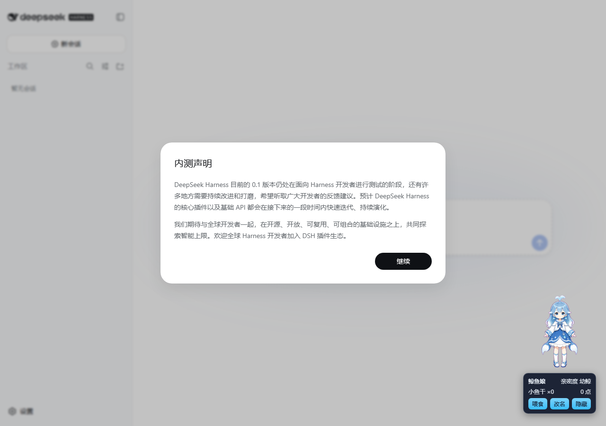

# dsh-pet issue #341 browser validation

Date: 2026-08-17

Branch: `feat/pet-interaction-sequences` at `75c7a20`

## Scope

This snapshot records local Chromium validation of the real `PetSprite.tsx`, the built-in whale manifest, and the built-in whale spritesheet for issue #341, followed by installation into an isolated live DSH Web profile.

## Method

A temporary Vite harness rendered the component at 1280 x 900 with the whale `thinking` scene active. Playwright sampled the inline spritesheet position, hovered the pet, measured the pet and panel boxes, moved the pointer through the complete gap in 2px steps, waited 400ms, and captured the page. The temporary harness was removed after the run.

The official `@deepseek-ai/dsh@0.1.0-rc.7` CLI was installed globally. An isolated `DSH_HOME` Web profile linked `packages/dsh-pet` with `dsh plugin --profile web add -w link:D:/Code/dsh-web-ui-issue-341/packages/dsh-pet`, and `dsh web` served the result at `http://127.0.0.1:4179`. Playwright then changed the display bottom through `/api/pet/set-config`, reloaded the live application, and measured both the legacy and default placements at 1280 x 900.

## Result

- Scene sequence: PASS. The sprite moved from the `running` row (`0px -1120px`) to the next `running-right` row (`0px -160px`) after the first track completed.
- Panel placement: PASS. The pet box was `{ x: 912, y: 550, width: 148, height: 160 }`; the panel box was `{ x: 909, y: 718, width: 154, height: 86 }`, placing the panel 8px below the pet.
- Hover bridge: PASS. The panel remained mounted after the pointer crossed the full 8px gap and the 400ms grace window elapsed.
- Live mount: PASS. `dsh --profile web --dump-config` listed `id: pet` with `name: '@linxin666/dsh-pet'`; `/api/pet/state` returned `whale-girl`, and `/api/pet/pets` exposed the configured animation sequences.
- Legacy position fallback: PASS. With persisted `bottom: 20`, the live pet box was `{ x: 1108, y: 720, width: 148, height: 160 }` and the panel box was `{ x: 1105, y: 626, width: 154, height: 86 }`, placing the complete panel 8px above the pet.
- New default placement: PASS. With `bottom: 120`, the live pet box was `{ x: 1108, y: 620, width: 148, height: 160 }` and the panel box was `{ x: 1105, y: 788, width: 154, height: 86 }`, placing the complete panel 8px below the pet.
- Browser errors: PASS. Chromium reported no page errors during the live placement checks.

## Evidence

