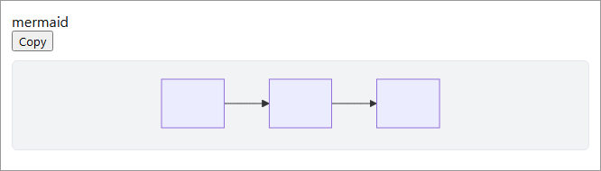
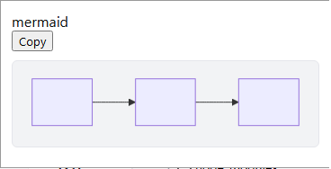

# Issue #451 Mermaid chat GUI validation

## Environment

- Date: 2026-08-18
- Branch: `fix/mermaid-infostring-detection`
- DSH CLI: `0.1.0-rc.7`
- URL: `http://127.0.0.1:3191`
- Profile: temporary isolated `DSH_HOME`, with `@linxin666/dsh-client-ui-aionui-panel` linked from this worktree
- Browser: Playwright Chromium, desktop `1280x900` and narrow `390x844` viewports

## Scenario

The package was built and mounted in the real DSH Web shell. An empty local workspace session was created without sending a model prompt so that `conversation.input.dock` and the chat enhancer were mounted. The browser then inserted the official `.md-code-block` structure with an empty `infostring` label and a sibling `<pre>`, followed by a separate mutation that changed the label text to `mermaid`. This reproduces the settled streaming path while avoiding any synthetic call into the enhancer.

## Result

- Before the label mutation: the source `<pre>` was visible, unclaimed, and no SVG existed.
- After the label mutation: `data-mermaid-state="done"`, `data-mermaid-claimed="1"`, the source `<pre>` had `display: none`, and one SVG existed.
- `/aionui-panel/vendor/mermaid.js` returned HTTP 200.
- The browser reported no console errors or page errors.
- The desktop and narrow viewports both kept the diagram visible without document-level horizontal overflow.

## Limitation

The validation used the official shell DOM structure inside a real mounted DSH Web instance, but did not spend an API request to generate an assistant response. It exercised this settled-mutation change together with the shell `infostring` discovery fix merged in PR #460; this PR's package test covers the mutation-scope behavior.
