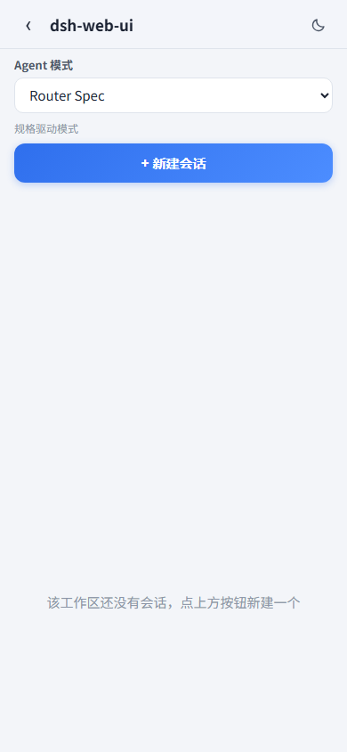
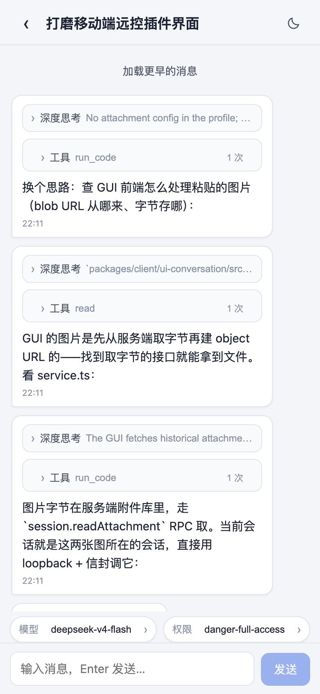

# DSH Remote Web UI

[English](README.md) | 中文

> 手机与电脑远程访问 + 一键远程更新：扫码配对后用手机远程使用当前 dsh web 工作区，同一枚令牌也可配对电脑浏览器、在其他设备上运行完整 Web GUI；侧边栏加载后静默检查 dsh-web 全家桶新版本，发现时标记更新按钮；点击按钮后自动更新全家桶。

本仓库是 DeepSeek Harness（DSH）的外部插件包：为 dsh web GUI 提供基于配对的手机与电脑远程访问，外加 dsh-web 全家桶的一键自更新。它是单一双半区包——host 半区持有配对令牌、设备会话、`/api/pair` 路由族、门控的 `/remote` 桌面通道与 `/api/update` 面板；浏览器半区渲染侧边栏底部入口（下载触发按钮与设置按钮旁的手机图标入口）、带二维码的配对面板、实时设备状态、已授权设备列表，以及停止/刷新/复制操作，还渲染探测并执行更新的更新面板。

## 功能

- **入口**：设置按钮旁始终显示手机图标；悬停时显示“远程访问”提示。
- **面板**：「远程访问」标题、「通过手机或另一台电脑配对，远程访问当前工作区」副标题、「设备配对」卡片（含状态区「等待设备连接」+ 状态徽标）、大号二维码、各带复制按钮的手机链接（`/m/?pair=...`）与电脑链接（`/?pair=...`）、停止 / 刷新二维码操作，以及已授权设备列表（根据 User-Agent 推断的设备名称、在线/离线、最近活动时间、单台取消配对）。界面不渲染作为会话凭据的设备 id 或原始 User-Agent。两条链接共用一枚一次性令牌，任意设备配对成功后另一条立即失效。
- **手机侧**：扫码将手机与一次性、限时令牌绑定，并落地到 **`/m/` 独立移动端界面**——一款专为小屏设计的轻客户端（见[截图](#截图)），而不是把桌面 UI 塞进手机。该页面可安装为 PWA；每个已安装应用使用自己的已配对设备 cookie，存储隔离的移动端 Web App 需要在该上下文打开新的二维码链接，或粘贴桌面端新复制的链接完成配对。链接携带 `workspace` 参数，手机落地到桌面正在查看的同一工作区。
- **PC 侧（远程桌面配对）**：同一份二维码链接和配对令牌也能配对 PC 浏览器——把手机侧配对流扩展到桌面 Web GUI。从面板复制链接，在另一台电脑的浏览器打开（局域网 URL 或隧道 URL 均可）；接受往返后，完整 Web GUI 在那台设备上运行——工作区、会话、聊天、切模型——受围栏保护的同源流量走门控的 `/remote` 通道，而不是直接调用仅 loopback 的 host 路由。手机进 `/m/`，PC 进桌面 UI：一枚令牌、一套配对流、两种界面。未配对的 PC 只看到不渲染底层数据的完整阻断页，其中提供电脑配对步骤与「重新检测」操作。
- **安全**：一个有效的一次性令牌（刷新会使旧链接失效；已接受的令牌不可复用；令牌会过期）。停止会撤销每一台已配对设备与当前令牌——已配对设备在下一次请求时被切断。配对是本插件对自己远程通道的访问控制：手机走 `/m/api`，非 loopback origin 打开的桌面浏览器走 `/remote`。未配对调用方在 `requirePairingForLan` 开启（默认）时会在读取请求体之前就被 `/remote` 拒绝。loopback（127.0.0.1）继续直接使用 `/api`。默认的远程桌面路径不使用 `--trusted-host`：连接插件的 `/api` 围栏对公网和局域网主机保持关闭，已配对 PC 改走 `/remote`。`--trusted-host` 是 SDK 的另一种用法，会让该主机被信任访问 `/api` 本身——配对不门控 `/api`（任何插件都无法做到；围栏是 SDK 自己的接缝）。当 `/api` 无需配对即可到达时，下方姿态探测会报告该姿态。
- **已配对模型目录**：已认证的已配对设备可使用 `GET /api/pair/model-catalog`、`POST /api/pair/model-catalog/discover` 和 `POST /api/pair/model-catalog/upsert`，仅查看并采纳一个现有、活跃的 `llm-pi-ai` provider 的模型。该能力在内部固定 provider 的 settings 地址，不能创建 provider，也不能读取或修改凭据、通用 settings、端点、header 或任意配置。这三条精确路由在 connection 插件的 `/api` 前缀之前匹配，已配对的局域网或隧道客户端可直接调用，并套用与 `/api/pair` 兄弟端点相同的 Host/Origin 信任围栏：仅接受 loopback、广告的局域网字面量或配置的公网 base URL。经 `/remote` 桌面通道访问时，所有 `/api/pair/*` 路径仍保持仅 loopback。当 provider 的实时模型目录不可用或未知时，采纳会被拒绝。解析后的 `models` 列表缺失或为空时，provider 会继续继承已安装目录；只有加入未知的自定义模型时才会实体化完整目录，现有模型 override 会保留并转换到对应条目。格式错误或相互冲突的模型配置会被拒绝，不会被破坏性重写。停止或撤销设备会立即禁用它；通用 `settings.*`、`credentials.*` 和 `llm.discoverModels` RPC 方法仍然仅限 loopback。
- **远程桌面通道**：`requirePairingForLan` 开启（默认）时，经局域网 URL 或隧道打开的桌面 Web GUI 透明地改走 `/remote`——同一套 UI，同一枚配对 cookie 门控。改写补丁在解析期即生效：宿主把一段内联 classic script 注入到 `<head>` 开标签之后（`webserver/index-inject`），使 fetch/WebSocket/EventSource 与资源 `src` 改写在任何启动条目执行前就绪（连接插件最先打开事件流）；浏览器半边随后接管已安装的 seat 而非重复打补丁。loopback 来源完全跳过该补丁。浏览器中 `/api`、`/sidebar`、`/git`、`/pet` 下的请求，以及已知的事件、终端与 SSH WebSocket，会在不转发远程 Origin 或配对 cookie 的前提下重新发给本机 Web Server；认证反代会为兄弟路由围栏提供自己生成的同源浏览器标记。SDK 的 loopback 专属特权方法（原生对话框、settings 与 credentials 面）对已配对远程桌面保持不可达；`/api/pair/*`（包括三条模型目录路由）、`/api/update/*`、`/api/plugin-manager/*`、`/api/dsh-desktop-launcher/*` 与 `/api/dsh-web-ui-settings/*` 控制端点保持仅 loopback。未配对的桌面浏览器看到持久的全页阻断界面而不是数据（阻断页按错误码 `unpaired` 触发，不是任意 403）。阻断页在任一门控调用成功后，或通道本身被拆除时退出——把 `requirePairingForLan` 关掉（或关闭插件）也会清掉通道短暂激活期间弹出的提示。
- **姿态探测**：插件用伪造 Host 头（公网 base 与每个 LAN base）探测 SDK 的 `/api` 围栏。403 是默认姿态（围栏关闭，远程访问走配对）。任何非 403 结果——`--trusted-host`，或 `--host 0.0.0.0` 下 SDK 的局域网自动信任——都会以 CRITICAL 日志与配对面板红色横幅呈现，因此 SDK 的 `/api` 信任姿态是被看见的，而不是被假设的。探测失败会丢掉进行中的目标缓存，相同 origin 会在下次触发时重试。
- **实时状态**：桌面面板经 SSE 流实时镜像配对状态（等待 → 已连接 → 已断开），并展示已授权设备名单。
- **远程更新**：侧边栏加载后，底部的下载触发按钮（手机图标左侧）会静默探测 npm registry 上已安装的 `@linxin666/dsh-*` 全家桶版本；发现可自动更新的新版本时，按钮显示圆点并提供“发现新版本，检查更新”提示。点击按钮打开更新面板；未安装聚合包时，检查和更新覆盖 profile 中 registry 管理的全部 `@linxin666/*` 直接依赖，本地 link / file 开发依赖会被跳过。当存在较新版本时，面板优先展示 GitHub Release 说明的「新增功能 / 修复 / 其他改动」分组，并把组件版本对比折叠起来，等待确认——点击「开始更新」后执行更新（在所属 dsh profile 内 `pnpm update --latest`；pnpm 缺失时依次回退 `corepack pnpm`、`npx --yes pnpm`，Windows 上经 `cmd.exe` 执行以解析 npm 安装的 `.cmd` shim；由仅 loopback 的 `/api/update/status` + `/api/update/run` 端点驱动）并请求重启 dsh web 以生效。pnpm 绿色退出后还会对照 registry 复核已装版本：绿色退出但版本纹丝不动（例如 pnpm 的 `minimumReleaseAge` 门禁静默跳过同日发布的新版本）会报告为「未更新成功」并附配置指引，而不是误报成功。锚点自身是本地 link 安装（开发模式）时，只报告 npm 状态而不更新。

## 截图

390pt 视口下的手机界面。亮色是默认主题；每个页头内的日/月切换随时翻到暗色调色板。

- **工作区**——列表，每行一个工作区及其各自的会话：
- **会话**——一个工作区的会话，头部是 新建会话 按钮（创建附加到该工作区的空白会话并立即打开）：
- **聊天**——带桌面折叠纪律的消息（折叠的 深度思考 推理与 工具 工具调用行）、钉住的输入栏带 模型 / 权限 chips，以及 agent 工作时的实时流：
- **模型选择**——底部弹层，provider 分组目录 + 每模型 思考强度 区（与桌面使用的同一份 `session.models` 目录）：

## 需求

- 其 `dsh` CLI 支持 profile（`dsh --profile`、`dsh plugin`）的 DSH 安装——本包所依托的 profile/bundle 机制。
- 局域网使用必须手机可到达服务器：用 `dsh web --host 0.0.0.0` 启动。默认 `127.0.0.1` 绑定时，面板会显示明确说明而不是死二维码——除非配置了公网 base URL（见下文「通过互联网远程访问」），那会让二维码在无需重新绑定即可从任意位置访问。面板的 mint/stop 端点设计上仅限 loopback：在局域网 URL 打开的桌面浏览器只会看到「配对面板仅限本机使用」横幅——请在 `http://127.0.0.1` 打开面板，让手机使用配对链接。
- 一键公网隧道（`autoTunnel`）需要 `cloudflared` 平台二进制随包分发（其 postinstall 会下载它；运行时下载覆盖跳过 postinstall 脚本的安装器）。无需用户侧工具、账号或域名——Cloudflare quick tunnel 免费且匿名。
- 把 `/m/` 安装为 PWA 需要安全上下文：`localhost` 和 `127.0.0.1` 可用于本机，手机安装需要 HTTPS。普通局域网 HTTP 仍可在线使用移动端远程控制，但无法注册其 Service Worker。

## 安装

推荐直接安装全家桶聚合包 `@linxin666/dsh-web-all`（一个包装齐全部功能插件与皮肤），或单独安装本插件：

```sh
### 从 npm 安装（推荐）
dsh plugin --profile web add @linxin666/dsh-remote-web-ui@latest

### 从仓库安装（开发调试）
git clone https://github.com/zhu1090093659/dsh-web.git
cd dsh-web
pnpm install && pnpm -r build
dsh plugin --profile web add link:$(pwd)/packages/dsh-remote-web-ui

```

重启 profile（`dsh web`），然后打开侧边栏底部的手机图标。插件的 `cordis.patch.yml` 插入装载两个半区的单条插件行。

> `github:<org>/<repo>` 安装适用于包位于仓库根部的独立仓库（`prepare` 脚本在安装时构建 `lib/`；pnpm ≥10 会阻断它，直到你把打印的 key 复制进 profile 的 `pnpm-workspace.yaml` `allowBuilds` 并重跑）。monorepo 子包使用上面的 `link:` 形式。

## 使用

1. `dsh web --host 0.0.0.0`（打印的局域网 URL 确认可达性）。
2. 点击手机图标 → 面板铸一枚新的二维码。
3. 用手机扫码（或打开复制的链接）：手机绑定并落到 **`/m/` 独立移动端界面**——不在小屏显示桌面 UI。该界面刻意精简：
   - 直接进入工作区（每个工作区的会话列表在 新建会话 前提供 Agent 模式选择器：默认选择可用的默认预设，否则选择第一个可用预设，并把该清单 id 与工作区 id 一起传给 host 的 `session.create`；清单为空或不可用时保留 host 默认创建流程），
   - 一个工作区的会话**增量**加载（每页 20 行，"加载更多会话"继续；绝不同时加载整份列表），
   - 打开会话**按需**抓取聊天内容（历史分页，"加载更早的消息"继续往回翻），
   - 实时流随消息到达展示新消息，带发送自己消息的输入框（默认 **Enter 发送、Shift+Enter 换行**；设 `mobileEnterToSend: false` 后 Enter 改为换行，发送仅走「发送」按钮），
   - **亮色优先主题**：界面默认亮色调色板；每个页头内的日/月切换翻到暗色调色板，选择跨访问持久（localStorage），
   - 消息按桌面折叠纪律渲染：推理隐藏在被折叠的 深度思考 揭示下面，工具调用隐藏在被折叠的 工具 行下面（点击查看每个调用的参数），超长回答藏在显式 展开全文 切换下面，每行带时间，并且 assistant 回复按 GFM Markdown 渲染（标题 / 加粗 / 斜体 / 行内码 / 代码块 / 列表 / 表格 / 引用 / 链接 / 图片；零依赖自写渲染器，先转义再白名单协议，移动端 bundle 体积几乎不变；KaTeX 公式暂不支持，后续单独评估），用户消息保持纯文本，
   - 输入栏工具条带 **模型** 选择器（provider 分组目录 + 每模型 思考强度 effort 区）与 **权限** 选择器（权限预设；完全权限 需要显式确认步骤）。两者都走 host 自己的 `session.models` / `session.selectModel` RPC 与 `/permission` 命令——手机改的与桌面改的是同一个会话设置——外加 **显示** 弹层（含 工具调用 与 系统提示词 两个持久开关）和一个 上下文 用量 chip（显示最近一次助手回答的上下文占用百分比）。
 4. 在安全 origin 上从浏览器安装 `/m/` 页面。已安装应用保留相同的移动端远程控制能力；其浏览器上下文没有已配对设备 cookie 时，把桌面端新复制的配对链接粘贴进配对页面。
 5. **改为配对 PC**：复制同一份链接，在另一台电脑的浏览器打开——用桌面 URL 形态（`/?pair=<token>`，不是 `/m/`）。接受往返后，完整 Web GUI 在那台设备上经门控的 `/remote/api` 通道运行；未配对的 PC 只看到带操作指引的阻断页且无数据。一枚有效令牌配对一台设备；给下一台设备配对请刷新出新的二维码。
 6. 桌面徽标实时翻到 已连接；手机离开时回落到离线/断开。
 7. 刷新二维码 使旧链接失效并铸一枚新的。停止 撤销移动端访问：已配对设备下一次请求 403，包括其实时流。

该移动端界面完全自包含在本插件内：`/m/` 页面及其数据通道（`/m/api`）由插件自己的路由伺服，**无需任何 harness 源码改动**——手机的 RPC 调用走插件的 `/m/api` 代理（它委托给 host 的 ApiProxy 服务并自己分页 `session.list`），因此被隧道化的 Host 永远不必进入连接插件的信任围栏。手机受其已配对设备 cookie 与 `/m/api` 显式方法白名单门控（白名单只约束 `/m/api` 代理本身：该 cookie 同时通过全局 api/gate，对宿主 `/api` 面是全量控制凭证——settings/credentials/host-action 域仅因 SDK 把这些特权方法钉为仅 loopback 才不可达。配对即对设备的完全信任；`/m/api` 代理的模型读写限制于建议性的 `session.models` / `session.selectModel` 对；另外，精确的已配对模型目录路由可为一个现有、合格的 `llm-pi-ai` provider 采纳模型，但不能创建 provider，也不能访问凭据或通用 settings；Agent 预设访问限制于只读 `agentPreset.list`，创建限制于 `session.create`（工作区 id 加清单中的可选 id——手机绝不自命名工作目录），权限选择器只通过已放行的 `session.prompt` 发送模式无关的 `/permission` 命令；会话控制只放行 `session.cancel`——停止当前回合并保留 pending 队列工作，手机端不做队列管理）；实时流在 `/m/api/events.mux` 上经 Server-Sent Events 送达。规范的 `/m/` 页面拥有同 scope 的 manifest 与 Service Worker；其缓存仅包含静态壳和离线页，绝不包含移动端 API 响应、会话数据或命令。

### 行为说明

- 会话运行中（turn/start 至 turn/end 之间），输入栏主按钮由「发送」切换为「停止」（与桌面端输入栏的 Send/Stop 切换一致）：点击调用 `session.cancel` 停止当前回合（pending 的排队消息在取消后按序恢复）；停止请求进行中按钮禁用，回合结束后恢复为「发送」。
- 移动端输入框默认 Enter 发送（Shift+Enter 换行）。在插件设置卡片（或 profile patch）把 `mobileEnterToSend` 设为 false 后，普通 Enter 改为插入换行，只有「发送」按钮会发送；手机打开聊天时经自己的 `/m/api` 偏好方法读取该开关。在支持 `field-sizing: content` 的浏览器上，输入框随草稿自动增高，最高 120px 封顶（两种模式一致）。
- `/m/` Worker 对静态壳使用 network-first 回退，并等待当前页面关闭后才激活更新。它旁路 `/m/api`、`/api`、SSE 与所有写请求。
- 安装本插件后，非 loopback 桌面中受围栏保护的流量会改走门控的 `/remote` 通道（见 `src/index.ts` 的 `requirePairingForLan`）。在该开关开启（默认）时，经局域网 URL 或隧道打开的桌面浏览器必须像任何远程设备一样配对——未配对状态显示完整阻断页而不是数据；loopback（127.0.0.1）不受影响，继续使用原始路径。把 profile patch 里 `requirePairingForLan` 设为 false 可让桌面继续走普通 `/api`，残留的 `/remote` 改写也会放行未配对调用（仅在开放局域网姿态下有意义；loopback-only 路径仍被拒绝），同时保留令牌/状态/撤销。注意 `/api` 路由本体属于 SDK：`--host 0.0.0.0` 绑定时 SDK 自动信任局域网字面量，绕过 UI 的局域网客户端仍能直接访问 `/api`——姿态探测会在面板上报告该姿态。
- `/api` 之外的兄弟 host 路由（`/pet/*`、`/git/*`、右侧面板的 `/aionui-panel/*`）可查询本插件的 `remoteWebUiPairing` 服务：有效的已配对设备 cookie 是放行路径，`stop()` 仍会切断它们；未安装本插件时该服务不存在。
- 二维码链接基于机器的非内部 IPv4 字面量构建；多宿主主机（Wi-Fi + 有线，或代理/VPN 虚拟适配器）会显示单选器供你发布手机实际可达的网络。第一个字面量是默认值。设 `publicBaseUrl` 后，单选器在顶部额外加一项 公网地址——默认二维码改用公网 base，选中局域网字面量会重新铸一枚网内链接。
- 配置的 `publicBaseUrl` 本身满足可达绑定需求：`dsh web` 绑定 `127.0.0.1`（不带 `--host 0.0.0.0`）仍能经隧道铸出可用的公网二维码链接。

## 通过互联网远程访问（隧道）

### 一键公网隧道（推荐）

在插件设置卡片打开 `autoTunnel`（或设 profile patch `autoTunnel: true`）。插件随后运行自己的 Cloudflare quick tunnel——`cloudflared` 二进制随包分发，无需安装、账号或域名——并自动接通一切：

- 铸出的 `https://xxx.trycloudflare.com` URL 成为二维码 base，因此任意地点的手机都能配对。面板显示隧道状态（starting / running / failed 带原因），崩溃按退避自动重启。

二维码在隧道报告其 URL 前保持仅局域网，且隧道重启会铸一枚**新的** hostname——插件清除旧链接并铸一枚新的，用户永远不必触碰配置。注意 quick tunnel 是公网的：任何拿到 URL 的人都能加载静态页；已配对设备 cookie 门才是真正的围栏（手机的 `/m/api` 带方法白名单、远程桌面的 `/remote/api`）。连接插件的 `/api` 围栏则直接拒绝隧道化主机——被隧道化的 Host 永远不进入连接信任围栏——因此 **auto tunnel 工作无需任何 profile 或 harness 定制**。`--trusted-host` 不属于这条路径：已配对 PC 走 `/remote/api`。

### 手动隧道（自带）

二维码链接通常是局域网 URL，所以家外的手机无法使用。把隧道指向 dsh web 端口，并告知插件其公网地址——二维码随后由隧道 URL 构建。涉及一个钮；`--trusted-host` 是独立的 SDK flag，不属于这条配对流：

- **`publicBaseUrl`**（插件配置，在 profile patch 或设置卡片里）：公网 origin，如 `https://foo.trycloudflare.com`。二维码链接由它构建，`accept`/`heartbeat`/`status` 接受它的主机。已配对的桌面浏览器经同一 origin 走门控的 `/remote/api` 通道，因此桌面 Web GUI 也能从任意地点使用。畸形值被忽略并告警（保持仅局域网行为）。未配对调用方的 `status` 只看到配对相关字段（phase / 局域网地址）；token 过期时间、设备列表与隧道 URL 需要有效设备 cookie。accept 限速按客户端可见的 `X-Forwarded-For` 跳点分桶，避免隧道背后的单个来源耗尽共享桶。
- **`--trusted-host <隧道域名>`**（可选的 dsh web flag，安全上不建议用于本插件）：优先使用设备配对，让手机走 `/m/api`、PC 走 `/remote/api`。该 flag 会让主机被 SDK 信任访问 `/api` 本身，因此未配对调用方可以到达无门控的 host API；配对仍门控 `/m/api` 与 `/remote/api`，但不门控 `/api`。若仍设置，姿态探测会报告敞开的 `/api` 围栏。

### Cloudflare 隧道（quick tunnel——无账号、无域名）

先安装一次客户端（macOS：`brew install cloudflared`；其他系统：从官方 GitHub releases 拿 `cloudflared-darwin-{arm64,amd64}` 二进制）。然后：

```sh
# 1. 暴露本地端口（dsh web 监听的任何端口）：
cloudflared tunnel --url http://127.0.0.1:3080
#    打印类似：https://xxxx-xxxx-xxxx.trycloudflare.com

# 2. 照常启动 dsh web。不必为隧道域名加 --trusted-host，除非你有意让 SDK
#    信任该主机访问 /api（配对不管 /api；远程桌面走 /remote/api）。
#    仅需保留局域网访问时才加 --host 0.0.0.0：
dsh web
```

然后在 profile patch（或插件设置卡片——它会热重载）里设 `publicBaseUrl: https://xxxx-xxxx-xxxx.trycloudflare.com`。在 `http://127.0.0.1` 打开手机图标，从任意处扫码：手机绑定、重载进移动端界面，心跳保持其在线。在同一隧道 URL 打开的桌面浏览器以同样方式配对，随后完整 Web GUI 经门控的 `/remote/api` 通道运行。

说明：

- Quick tunnel 免费无需登录，但 hostname 每次运行随机：每次 `cloudflared` 重启都变，所以 `publicBaseUrl` 要随之更新。Cloudflare 不保证 uptime；在途请求并发受限（超过返回 HTTP 429），且 **Quick Tunnels 不转发 Server-Sent Events**。`Tailscale Serve`（以及单端口的 `tailscale serve`）行为相同。SSE 是手机**实时接收消息**的方式，所以在 quick tunnel 或 Tailscale Serve 上移动端聊天回退到轮询：手机仍收发消息（其余都走普通 HTTP，可转发），只是新消息可能晚几秒而非即时。SSE 通道一旦静默，插件按短间隔轮询 `session.history`，SSE 恢复后立即恢复流式。要真正实时推送，把二维码指向能转发 SSE 的隧道——Cloudflare **named tunnel**（域名托管在 Cloudflare，见下），或普通 TCP 端口转发（局域网地址、`tailscale up` 虚拟接口地址，或手动 `ssh -L` / 指向端口的 cloudflared TCP 隧道）。远程桌面浏览器不受影响：其事件流走 WebSocket upgrade，quick tunnel 可转发。
- Quick tunnel 是公网的：任何拿到 URL 的人都能加载静态页。已配对设备 cookie 门才是真正的围栏——未配对设备每个 `/m/api` 与 `/remote/api` 调用都 403——所以请保持 `requirePairingForLan` 开启。`--trusted-host` 这条路径用不到，且会在配对之外打开 SDK 的 `/api`。
- 稳定 hostname 可从 Cloudflare 控制台创建 named tunnel（Networking → Tunnels；域名必须托管在 Cloudflare），其 hostname 只用作 `publicBaseUrl`。Cloudflare 不保证中国大陆可达性；请本地验证。
- Tailscale 是无需任何插件改动的个人替代：其虚拟接口地址（`100.x.y.z`）自动出现在二维码的地址选择器中，同一 tailnet 的手机像局域网主机一样到达它。

## 开发

从这个仓库工作（无需 sibling checkout）：

```sh
cd ~/code/dsh-web-ui
export NPM_TOKEN='<token>'   # 仅当私有 @deepseek-ai 认证仍需要时
pnpm install
pnpm --filter @linxin666/dsh-remote-web-ui run build
pnpm --filter @linxin666/dsh-remote-web-ui test
pnpm --filter @linxin666/dsh-remote-web-ui run typecheck
```

peer APIs 来自官方 NPM SDK：这里用到的每个 `@deepseek-ai/*` 包都声明在 devDependencies（rc.6）里，TypeScript/Vitest 直接从 node_modules 解析类型——无需 DSH 源码 checkout。消费者侧 `prepare` 构建（`tsdown.prepare.config.ts`）不做类型检查转译，因此 git 安装也无需任何 harness checkout。

## 检查

```sh
pnpm run typecheck
pnpm test
pnpm run build
```

## Harness 契约依赖

本插件依托三个在较老 checkout 里可能不存在的 harness seam：

- **`api/gate` 瀑布**（packages/client/connection）：/api 路由与事件 WebSocket 升级被*设计*为在信任围栏后发出该事件，插件可据此实施应用层访问控制。当前已发布的 SDK 线**并不**发出它（监听器为将来具备该 seam 的部署保持挂载）。因此手机与 PC 的配对都落在本插件自己的路由上（`/m/api`、`/remote/api`）；姿态探测报告 SDK 的 `/api` 围栏姿态，而不是假设它。
- **`sidebar.remote` 底部座位**（packages/client/ui-sidebar）：侧边栏声明并渲染手机入口占据的座位。
- **局域网运行时连接修复**（host-apiproxy 为不安全上下文 origin 的 `mintRpcId` 回退；20260808 分支在 mux 流之后打开 host 流的连接循环）：没有它们，浏览器 runtime 根本无法在纯 HTTP 局域网页上运行（本特性的移动端侧）。

围栏辅助（`isTrustedApiRequest` / `isLoopbackHostname`）在 `src/gate.ts` / `src/routes.ts` 本地重实现：20260810 upstream 把信任围栏移进连接插件并停止导出它们，因此配对路由携带自己限定到二维码链接广告的字面量的副本。见 harness checkout 的 Agent Notes `api-gate-and-sidebar-remote-seat` 与 `lan-runtime-connection-fixes`。

## 手动 E2E：局域网配对往返

单元/组件 spec 覆盖路由族、门与面板，但配对循环涉及非 loopback origin 上的真实浏览器。任何 wire 契约或连接循环改动后重复：

1. 用测试工作区根在所有接口上启动服务器：`dsh web --host 0.0.0.0 --port 3190 --workspace-root /tmp/remote-e2e`。
2. 在浏览器打开 **loopback** URL（`http://127.0.0.1:3190`）：手机图标在侧边栏底部；面板立即铸一枚二维码。
3. 在第二个 tab（或手机）打开带配对令牌的 **局域网** URL（如 `http://192.168.1.7:3190/?pair=<token>`）：页面接受、设置 HttpOnly `dsh_pair` cookie、重载并启动完整 UI——无 console 错误，并且完成一次 generation 往返。
4. 桌面徽标实时翻到 已连接；局域网 origin 的桌面页则显示 配对面板仅限本机使用 横幅且不打开状态流。
5. 桌面 停止 切断手机：其下一个 `/api` 请求 403（重连循环重试直到新二维码重新配对）。

公网路径是经隧道的同一往返（见「通过互联网远程访问」）：loopback mint → 手机或 PC 打开公网二维码 URL → accept → UI。只有 `publicBaseUrl`（插件配置）命名隧道主机；`--trusted-host` 不属于这条配对流。桌面面板仍在 `http://127.0.0.1` 打开。

## 安全模型

- 移动端普通接口与 mux 事件流都要求有效的已配对设备会话。会话缺失或已撤销时返回 HTTP 403，并使用带 `error.code: "unpaired"` 的 JSON 拒绝信封；浏览器 `EventSource` API 只暴露事件流失败，不暴露该响应体。

## 已知限制与待办

- **撤销是逐请求的**：已配对手机请求已在 停止 落地时在途，完成该请求；下一个 403。
- **已配对设备会话默认落盘**：设备会话（不含一次性二维码 token）写入 `$DSH_HOME/remote-web-ui-devices.json`（0600，临时文件加原子 rename）。已配对 cookie 在重启 `dsh web` 后仍然有效。刷新二维码仍会签发新 token；重启不会恢复当前二维码。点「停止」或单台「取消配对」会立即撤销并同步落盘。超过 `idleExpireMs`（默认 7 天，无心跳或门控请求）的会话会被删除，必须重新扫码。设备 id 即会话凭证（网关凭 cookie 中的设备 id 放行请求）。需要时可用 `devicesFile` 覆盖为其他绝对路径。变更 `cookieName` 会使旧设备失效（预期行为）。
- **设备名单仅本机可见**：配对面板根据 User-Agent 显示精简设备名称（例如 `Windows · Chrome`）、在线/离线状态与最近活动时间，并可单台取消配对。界面不渲染作为会话凭据的设备 id 或原始 User-Agent。`/api/pair/status` 即使对已配对手机也不返回设备 id 名单。
- **桌面门控策略是公开字段**：`/api/pair/status` 只公开布尔值 `requirePairingForLan`，让远程桌面在设置作用域不可用前选择正确传输通道。该字段不是凭据，也不暴露令牌、设备、计数或隧道 URL。
- **Quick-tunnel hostname 每次运行变化**：`trycloudflare.com` URL 每次 `cloudflared` 启动随机，所以隧道重启时 `publicBaseUrl` 必须随之更新。named tunnel（固定 hostname）避免这种抖动，也是持久安装 PWA 地址所必需的。
- **PWA 为在线优先**：只缓存静态壳和离线页。全部移动端远程控制能力仍要求运行中的 DSH host；离线时不提供会话、API 响应或命令。
- **开发 HMR**：`dsh web --dev` 按路径轮询每个 roster bundle，因此重建本包（其自己的 `tsdown --watch`）会热重载 client bundle；无 harness 侧 watcher。

## 依赖理由

`qrcode.react`（MIT，活跃维护，React 16–19 支持）将二维码渲染为无依赖的 SVG 组件——无 canvas、无服务端图片生成。它在构建时内联进 client bundle（与官方 skin/turtle-ui 插件内联其非共享依赖相同），profile 安装无需超出 dsh peer closure 之外的额外运行时依赖。`schemastery` 是 DSH 标准配置 schema 校验器。

## 数据遥测

浏览器半区每个 UTC 日向 dsh-market.com 发送一次匿名安装心跳：仅含一个 localStorage 随机 ID 与本包名，无其他数据。服务端只存储该 ID 的加盐哈希，不存 IP，且只暴露聚合计数。完整契约见 [docs/telemetry.md](../../docs/telemetry.md)。
